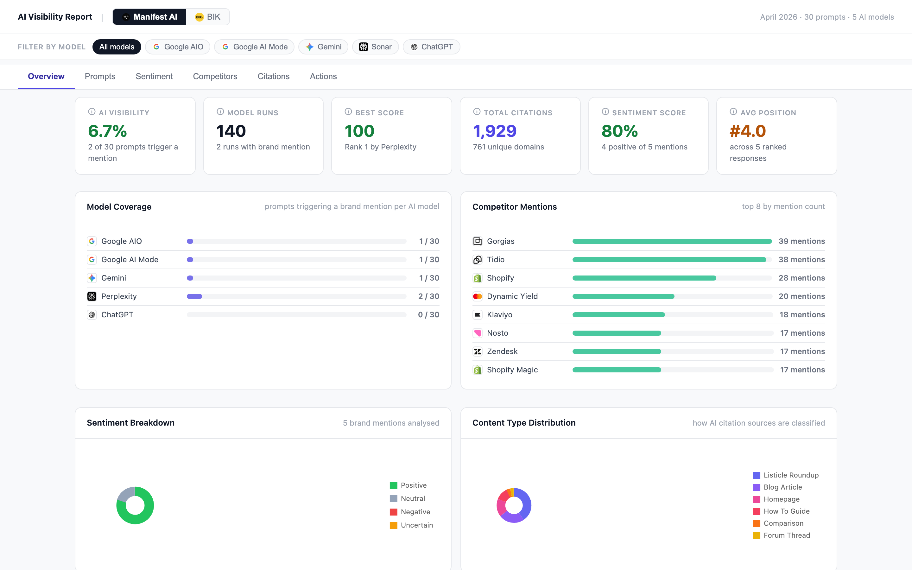
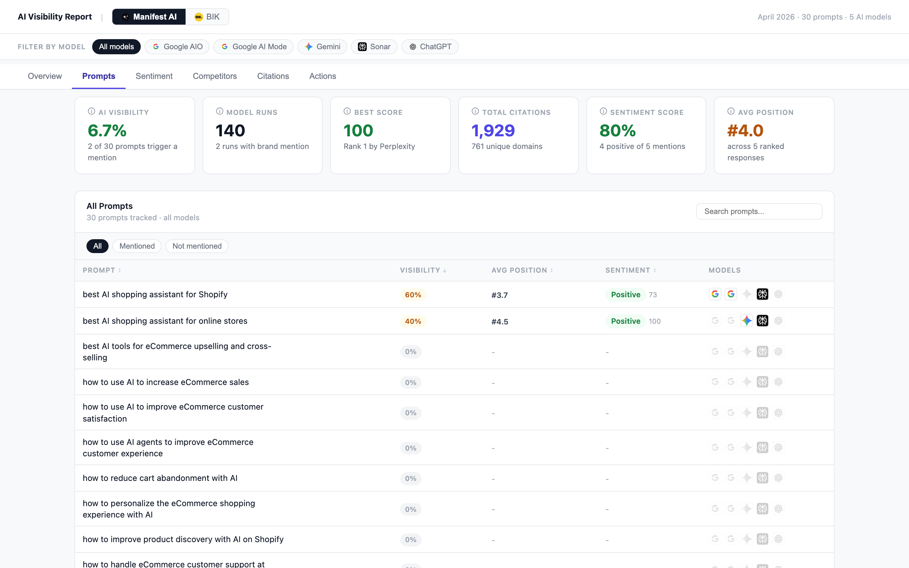
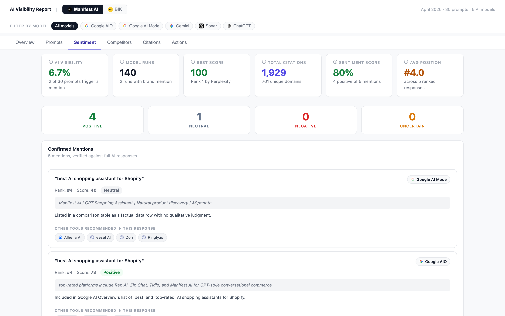
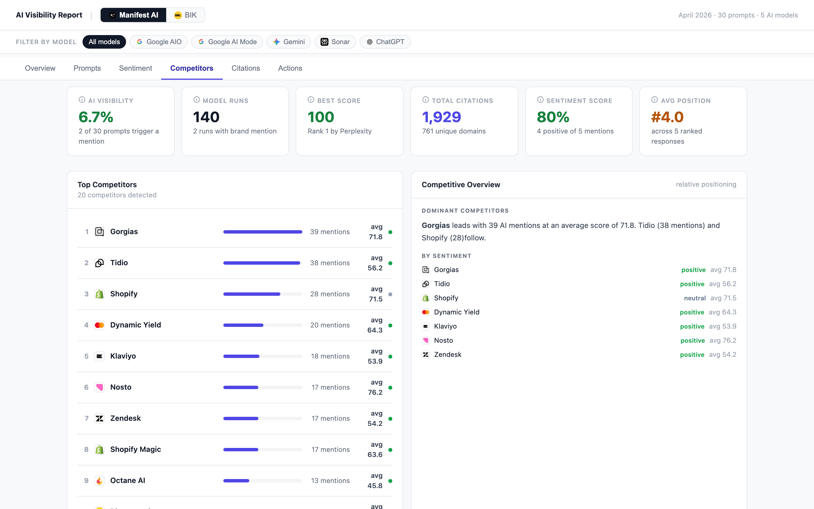
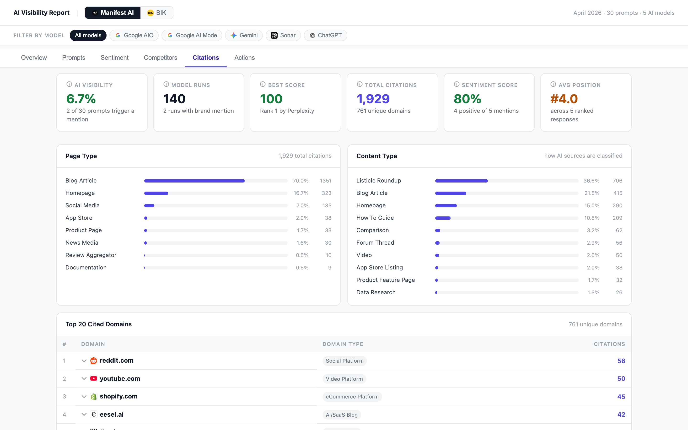
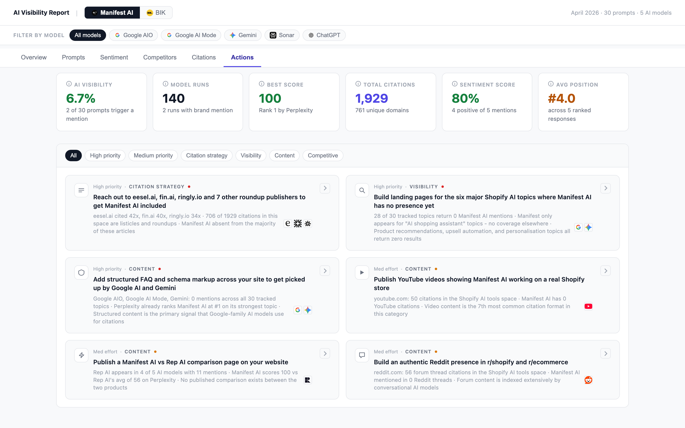

# AI Visibility Report

A command-line tool for marketing agencies to generate AI visibility prospect reports. Pull live data from the AI Peekaboo API, process it, and produce a self-contained HTML dashboard showing a brand's visibility across 5 AI models. Action recommendations are auto-generated by Claude based on the actual data.

---

## What the report includes

The report is a single HTML file with 6 tabs:

- **Overview** — Visibility scores across Perplexity, ChatGPT, Gemini, Google AIO, and Google AI Mode, with summary charts

  

- **Prompts** — Full prompts table showing visibility rate, sentiment, and position for each tracked prompt

  

- **Sentiment** — Breakdown of positive, neutral, and negative sentiment across prompts

  

- **Competitors** — Competitor rankings showing which brands appear most often alongside yours

  

- **Citations** — Citation analysis with top cited domains and citation frequency

  

- **Actions** — 6 data-driven recommendations generated by Claude, specific to that brand's data

  

Multi-brand configs produce a toggled comparison view so agencies can present multiple clients or compare a prospect against competitors in a single file.

---

## Requirements

- **AI Peekaboo account** on the Grow plan or above (required for API access)
- **Anthropic API key** for action generation
- **Python 3.8+**

---

## Quick start

1. Clone this repo:
   ```bash
   git clone https://github.com/your-org/ai-visibility-report.git
   cd ai-visibility-report
   ```

2. Install dependencies:
   ```bash
   pip install -r requirements.txt
   ```

3. Copy the example config and fill in your keys and brand IDs:
   ```bash
   cp config.example.json config.json
   ```
   Open `config.json` and replace the placeholder values with your AI Peekaboo API key, Anthropic API key, and brand details.

4. Run the build:
   ```bash
   python3 build.py
   ```

5. Open the report in your browser:
   ```bash
   open report.html
   ```

---

## Finding your brand ID

Brand IDs are UUIDs visible in the AI Peekaboo dashboard URL when you are viewing a brand. They look like `3fa85f64-5717-4562-b3fc-2c963f66afa6`.

You can also list all brands your API key has access to:

```bash
curl https://www.aipeekaboo.com/api/v1/brands \
  -H "X-API-Key: pk_YOUR_KEY_HERE"
```

---

## Multi-brand reports

Add multiple objects to the `brands` array in `config.json` to include more than one brand in the same report:

```json
{
  "brands": [
    {"id": "uuid-1", "name": "Brand A", "key": "brand-a", "domain": "brand-a.com"},
    {"id": "uuid-2", "name": "Brand B", "key": "brand-b", "domain": "brand-b.com"}
  ]
}
```

The report renders a brand toggle in the top navigation, letting viewers switch between brands within the same file. This is useful for agency prospect presentations and competitive reviews.

---

## Deploying to GitHub Pages

The output is a single self-contained HTML file with no external dependencies. To host it publicly:

```bash
REPO_NAME="brand-ai-visibility"
mkdir /tmp/$REPO_NAME
cp report.html /tmp/$REPO_NAME/index.html
cd /tmp/$REPO_NAME
git init && git checkout -b main
git add index.html && git commit -m "AI Visibility Report"
gh repo create $REPO_NAME --public --source=. --remote=origin --push
```

Then enable GitHub Pages for the repo (Settings > Pages > Deploy from branch: main / root). The report will be live at `https://<username>.github.io/<repo-name>/` within a minute.

---

## How actions are generated

The 6 action recommendations in each report are generated by Claude (`claude-sonnet-4-6`) using the actual data fetched from AI Peekaboo. They are not templates.

Claude receives the brand's real visibility percentages, the exact domains that appear most in citations, the competitor list with their relative visibility scores, sentiment distribution, and content type breakdown. Every recommendation is specific to what the data shows: if a competitor's knowledge base is cited 40 times and yours is cited 3 times, the action will reference those domains and counts directly.

Recommendations are written for SEO/AEO practitioners. The framing is always about topic ownership and getting listed in the sources AI models cite, not about "targeting prompts" or "submitting to AI models."

---

## Configuration reference

```json
{
  "aipeekaboo_api_key": "pk_...",
  "anthropic_api_key": "sk-ant-...",
  "brands": [
    {
      "id": "brand-uuid",
      "name": "Brand Name",
      "key": "brandkey",
      "domain": "brand.com"
    }
  ],
  "report_title": "Brand AI Visibility Report",
  "output_file": "report.html"
}
```

`config.json` is gitignored. Never commit your API keys.
